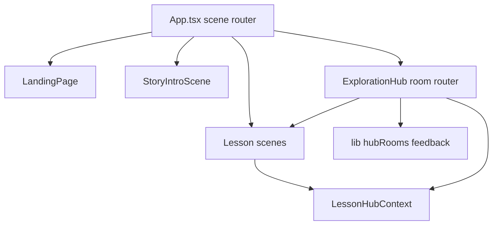

# Evrika — Project documentation

**Evrika** is an interactive lesson about Archimedes, buoyancy, and the crown of King Hiero. Learners move through story beats, physics labs, and a workshop hub—all in the browser (React + Vite + TypeScript).

## Quick links

| Area | Document |
|------|----------|
| Routing & scenes | [architecture/routing-and-scenes.md](architecture/routing-and-scenes.md) |
| Progress & unlocks | [architecture/progress-and-state.md](architecture/progress-and-state.md) |
| CSS organization | [architecture/styling-system.md](architecture/styling-system.md) |
| Components | [components/README.md](components/README.md) |
| Lib utilities | [lib/README.md](lib/README.md) |
| React hooks | [hooks/README.md](hooks/README.md) |
| Context providers | [context/README.md](context/README.md) |
| Stylesheets | [styles/README.md](styles/README.md) |
| Testing | [testing/README.md](testing/README.md) |

## Architecture overview



## Source layout

```
src/
├── app/              # Scene routing, navigation hooks (extracted from App.tsx)
├── components/       # UI and lesson scenes
├── context/          # LessonHub + global audio
├── hooks/            # Shared React hooks
├── lib/              # Pure utilities (unlocks, feedback, assets)
├── styles/           # Feature-scoped CSS (imported via styles/index.css)
└── types/            # Shared types (SceneId, etc.)
```

## Development

```bash
cd Project-Evrika
npm install
npm run dev
npm test
npm run build
```

## Related

- App README: [../README.md](../README.md)
- Test suites: [testing/README.md](testing/README.md)
