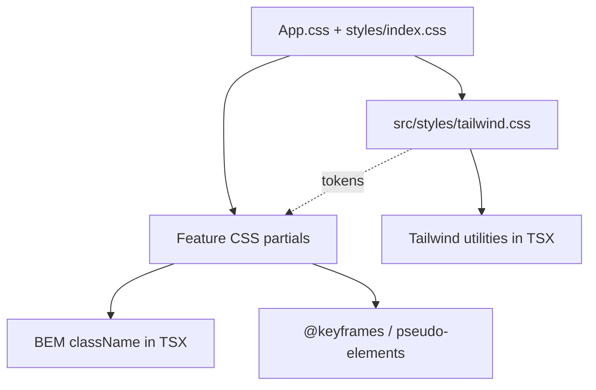

# Styling system

Evrika uses a **hybrid styling model**: Tailwind CSS v4 utilities for shared UI chrome, plus feature-scoped CSS for scene art, keyframes, and pseudo-elements. No CSS modules.

## Import chain

```
main.tsx → index.css (font smoothing only) + cursors.css
App.css  → styles/index.css
           ├── tailwind.css          (@theme tokens + utilities; preflight disabled)
           ├── base/reset.css
           ├── components/cloud-transition.css
           ├── layout/frame.css
           ├── landing/, scenes/, hub/, feedback-animations.css
```

See [`src/styles/index.css`](../../src/styles/index.css) — import order matters.



## When to use what

| Use Tailwind utilities in TSX | Keep feature CSS |
|-------------------------------|------------------|
| Modal layout, spacing, flex/grid | Scene art (landing hero, crown lab) |
| Form fields, buttons, chips | `@keyframes`, spark bursts, celebrations |
| Responsive padding on chrome | `::before` / `::after` indicators |
| Hover/focus/disabled states | Matter.js / canvas overlays |
| Shared tokens (`text-gold`, `desktop:`) | Cloud transition animations |

**Rules:**

- No `@apply` sprawl — utilities live in TSX; CSS files hold motion and art only.
- Use [`cn()`](../../src/lib/cn.ts) (`clsx` + `tailwind-merge`) for conditional classes.
- Keep BEM modifier classes when celebration/scene CSS depends on them (e.g. `hub-nav-item--locked`).

## Layers

| Layer | Path | Role | Styling approach |
|-------|------|------|------------------|
| Tailwind | `styles/tailwind.css` | Design tokens + utilities | Hybrid entry |
| Base | `styles/base/reset.css` | Reset, `#root`, `.app-root` | CSS only |
| Chrome | `FeedbackModal`, `GlobalAudioToggle`, `HubNavBar` | Shared UI | **Tailwind + animation CSS** |
| Layout | `styles/layout/frame.css` | Leaf vine frame | CSS only |
| Landing | `styles/landing/landing.css` | Hero, preview, journey | CSS only |
| Scenes | `styles/scenes/*.css` | Per-lesson BEM classes | CSS only |
| Hub | `styles/hub/` | Shell, celebrations, nav states | Mostly CSS; nav layout → Tailwind |
| Feedback | `styles/feedback/feedback-animations.css` | Keyframes only | Animation CSS |
| Transitions | `styles/components/cloud-transition.css` | Cloud navigation overlay | CSS only |

## Breakpoints

- **`960px`** — desktop vs mobile (`useDesktopExperience`, landing desktop gate)
- Tailwind token: `--breakpoint-desktop: 60rem` in [`tailwind.css`](../../src/styles/tailwind.css)
- Use `desktop:` / `max-desktop:` utilities in migrated components

## Shared helpers

| Helper | Path | Purpose |
|--------|------|---------|
| `cn()` | `src/lib/cn.ts` | Merge Tailwind classes without conflicts |
| `@theme` tokens | `src/styles/tailwind.css` | Colors, fonts, radii, shadows |

## Phase 5 re-evaluation checklist

After migrating chrome components, decide whether to expand Tailwind:

| Metric | Expand | Stay hybrid |
|--------|--------|---------------|
| Layout bug fix time | Faster in Tailwind components | Still jumping TSX ↔ CSS |
| Migrated CSS line count | Shrunk >50% | No meaningful reduction |
| Regressions | None in tests + smoke | Visual breaks |
| DX | Team prefers co-located utilities | Utility strings feel worse than BEM |

**Do not migrate** without justification: landing hero, hub celebrations, scene stylesheets, canvas overlays.

## Docs

- Stylesheet map: [styles/README.md](../styles/README.md)
- Tailwind reference: [styles/tailwind.md](../styles/tailwind.md)
- Migration tracker: [styles/migration-log.md](../styles/migration-log.md)
